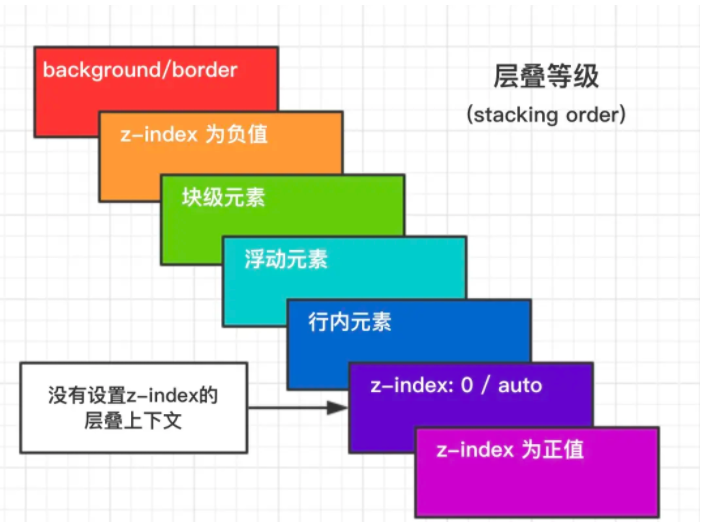

## 1. 盒模型
> 页面渲染时，dom元素所采用的 **布局模型** 。从内到外依次是 content，padding，border，margin 可以通过 box-sizing 设置。根据计算宽高的区域可以分为：
> - content-box W3C标准盒模型 标准盒模型中， width 和 height 指的是 content 的宽度和高度
> - border-box IE盒模型（怪异盒模型）。怪异盒模型当中，width 和 height 指的是 content + padding + border 的宽度和高度

## 2. BFC（Block Formatting Context）块级格式化上下文
> 块级格式化上下文，一个独立的渲染区域，可以理解为一个隔离了的独立容器。在该容器内的元素与外部的元素相互隔离，使内外元素的定位不会产生相互的影响。

- 触发条件
  - 根元素
  - position: absolute/fixed
  - float: !== none
  - display: inline-block/table/flex
  - overflow: !== visible

- 规则
  - 属于同一个 BFC 的两个相邻 Box 垂直排列
  - 属于同一个 BFC 的两个响铃 Box 的 margin 会发生重叠
  - BFC 中子元素的 margin box 的左边，与包含块（BFC）border box的左边相接触（子元素absolute定位除外）
  - BFC 的区域不会与float 的元素区域重叠
  - 计算BFC的高度时，浮动子元素也参与计算
  - 文字层不会被浮动层覆盖，而是环绕于周围

- 应用
  - 阻止 margin 重叠（同一个BFC内部的 margin 会发生重叠）
  - 可以包含浮动元素 - 清除内部浮动 （清除浮动的原理是让两个 div 都位于同一个 BFC 内部）
  - 自适应两栏布局（一边固定，一边自适应）
  - 可以阻止元素被浮动元素覆盖（一个元素浮动在另一个元素之上，底部元素触发 BFC 后，便不再被遮挡）

## 3. 层叠上下文
> HTML 元素沿着其相对于用户的一条虚构的 z 轴排开，层叠上下文就是对这些 HTML 元素的一个三维构想。
- 触发条件
  - 文档根元素（<html>）
  - position
  - css3属性
    - flex
    - transform
    - opacity
    - filter （Filters are commonly used to adjust the rendering of images, backgrounds, and borders）
    - will-change （告知浏览器该元素会有哪些变化的方法）
    - -webkit-overflow-scrolling （控制元素在移动设备上是否使用滚动回弹效果）
- 层叠等级：层叠上下文在 z 轴上的排序
  - 在同一层叠上下文中，层叠等级才有意义
  - `z-index` 的优先级最高
  

## 4. 居中布局

- 水平居中
  - 行内元素：`text-align: center`
  - 块级元素：`margin: 0 auto`
  - `absolute + transform`
  - `flex + justify-content: center`

- 垂直居中
  - `line-height: height`
  - `absolute + transform`
  - `flex + align-items: center`
  - `table`

- 水平垂直居中
  - `absolute + transform`
  - `flex + justify-content + align-items`

## 5. 选择器优先级

- `!important` > 行内样式 > #id > .class > tag > * > 继承 > 默认
- 选择器 **从右到左** 解析 

## 6.去除浮动影响，防止父级高度塌陷

- 通过增加尾元素清除浮动
  - `:after /   : clear: both`
- 创建父级 BFC
  - `overflow: hidden`
- 父级设置高度

## 7. link 于 @import 的区别

- 本质上的区别：link 是 html 标签，具有很多属性，可以定义 Rel等作用。而@import只能用于加载css
- 加载顺序的区别：解析到 link 是，页面会同步加载所引入的css，而@import所引用的css会等到页面加载完才被加载
- 兼容性方面的区别：@import需要IE5以上才能使用，而link因为是html标签，所以没有兼容性的问题
- 动态引入方面的区别：link 可以使用js动态引入，@import 不行
