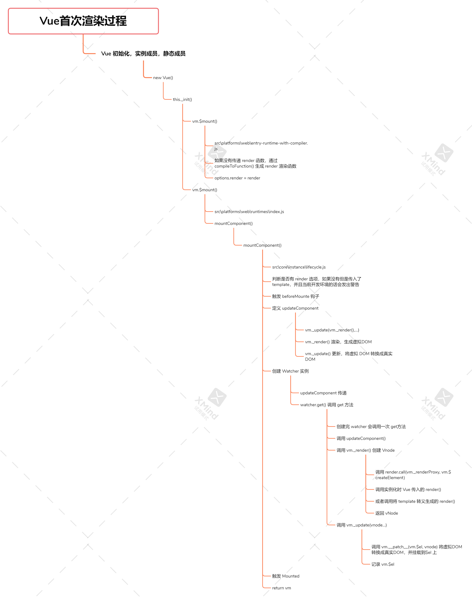
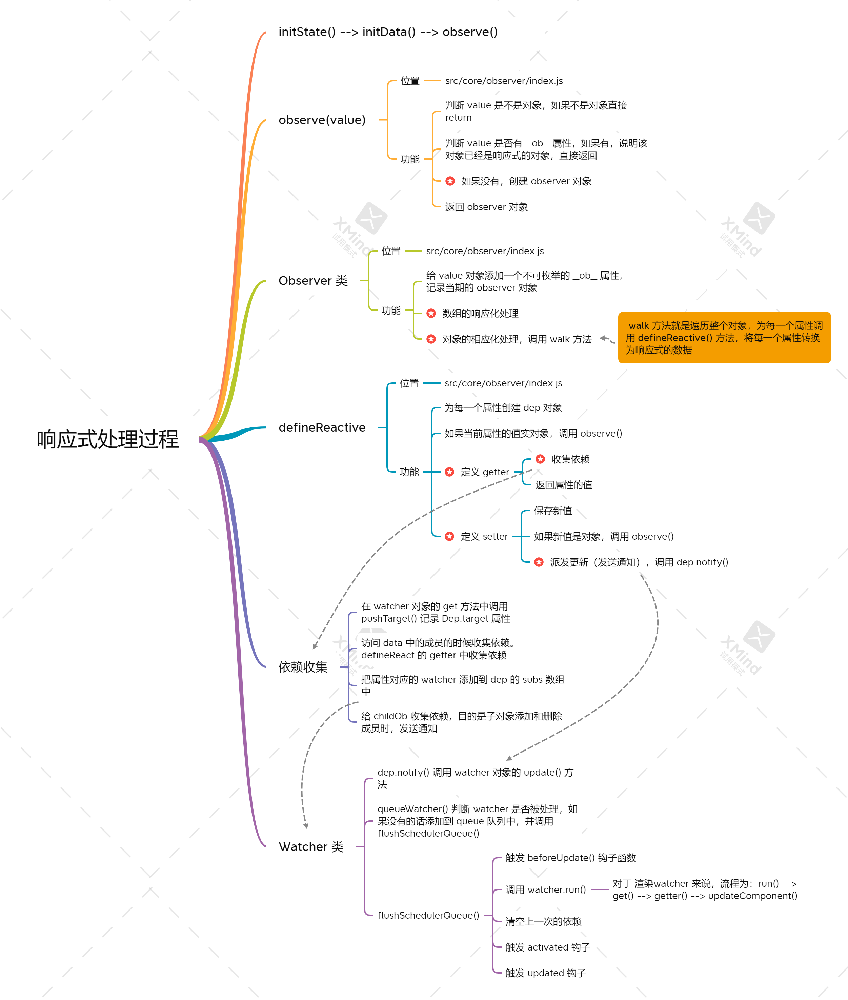

### vue的插槽以及插槽有哪几种

> 插槽`<slot>`可以理解为一个占位符，这个占位符将来可以承接组件标签内部的内容。

- 分类
  1. 默认插槽
   ```html
   <a
      v-bind:href="url"
      class="nav-link"
    >
      <slot></slot>
    </a>
   ```

  2. 具名插槽
   ```html
   // 定义
    <div class="container">
      <header>
        <slot name="header"></slot>
      </header>
      <main>
        <slot></slot>
      </main>
      <footer>
        <slot name="footer"></slot>
      </footer>
    </div>

    // 使用
    <base-layout>
      <template slot="header">
        <h1>Here might be a page title</h1>
      </template>

      <p>A paragraph for the main content.</p>
      <p>And another one.</p>

      <template slot="footer">
        <p>Here's some contact info</p>
      </template>
    </base-layout>

    // 或者直接在元素上使用
    <base-layout>
      <h1 slot="header">Here might be a page title</h1>

      <p>A paragraph for the main content.</p>
      <p>And another one.</p>

      <p slot="footer">Here's some contact info</p>
    </base-layout>
   ```

  3. 作用于插槽（注：slot-scope 已被废弃，由 v-slot 替代）
   ```html
   // 定义
    <ul>
      <li
        v-for="todo in todos"
        v-bind:key="todo.id"
      >
        <!-- 我们为每个 todo 准备了一个插槽，-->
        <!-- 将 `todo` 对象作为一个插槽的 prop 传入。-->
        <slot v-bind:todo="todo">
          <!-- 回退的内容 -->
          {{ todo.text }}
        </slot>
      </li>
    </ul>

    // 使用
    <todo-list v-bind:todos="todos">
      <!-- 将 `slotProps` 定义为插槽作用域的名字 -->
      <template slot-scope="slotProps">
        <!-- 为待办项自定义一个模板，-->
        <!-- 通过 `slotProps` 定制每个待办项。-->
        <span v-if="slotProps.todo.isComplete">✓</span>
        {{ slotProps.todo.text }}
      </template>
    </todo-list>
   ```

### computed 和 watch 的区别
- computed 计算属性
  - 是为了解决模板中出现太多的逻辑，导致模板过重和难以维护问题。
  - 监听所依赖的值，当依赖值发生变化时，才会重新求值。（这是与method 的区别）
- watch 方法
  - 当需要在某个数据变化时执行异步或者开销较大的操作时，使用watch

- 两者区别
  - watch 监听的是属性值，只要属性值发生变化，都会触发相应的逻辑
  - computed 监听的依赖值，依赖值不变的情况下会直接读取缓存进行复用，变化时会重新计算
  - watch 可以执行异步操作，而 computed 不能，必须是同步的
  - 本质上来讲，computed 和 watch 都是一个 watcher，当所依赖的数据发生变化时，就会发送通知，通知 watcher 进行更新。不同的是，computed 属性可能会依赖一个甚至多个值，每当其中一个任意一个变化时，都会触发这个计算属性watcher进行更新。而 watch 则是依赖一个特定的值，当这个值发生变化时，会触发这个侦听器的watcher 进行更新。
  - 计算属性适合用在模板渲染中，某个值是依赖其他的响应式对象甚至是计算属性计算而来；而侦听器适用于观测某个值的变化去完成一系列复杂的业务逻辑

### vue 父子组件的生命周期是怎样的？
- 加载顺序：父beforeCreate -> 父created -> 父beforeMount -> 子beforeCreate -> 子created -> 子beforeMount -> 子mounted -> 父mounted
- 更新顺序：父beforeUpdate->子beforeUpdate->子updated->父updated
- 销毁顺序：父beforeDestroy->子beforeDestroy->子destroyed->父destroyed


### nextTick

Vue 更新 DOM 是异步执行的，批量的

nextTick 就是在下次 DOM 更新循环结束之后执行延迟回调。在修改数据之后立即使用这个方法，可以获取更新后的 DOM

nextTick 异步实现方式，首先选用microTask, 如果浏览器不支持，则会选用macroTask
- microTask
  - Promise
  - MutationObserver
- macroTask
  - setImmediate
  - setTimeout

### Vue源码 - Vue 首次渲染流程

流程如下：

- Vue初始化实例成员，静态成员，调用`new Vue()`构造函数，生成新的 Vue 实例
- `new Vue()`的构造函数中会调用`this._init()`方法
- `this._init()`方法中，会调用`vm.$mount()`方法。
- `vm.$mount()`有两处，一个是`src\platforms\web\entry-runtime-with-compiler.js`文件中的。该方法会判断是否有 render 函数传入，如果没有，通过 `compileToFunction()` 方法根据 template 生成 render 函数。render函数确认后，`options.render = render`
- 另一个是`src\platforms\web\runtimes\index.js`文件中的`vm.$mount()`，这是 $mount 方法的核心功能，之前的 $mount 方法只是将 template 转换成 render 函数，方便开发。
  - 该方法会首先判断是否有 render 选项，如果没有但是传入了 template，并且当前是开发环境的话，会发出警告说明不支持将 template 转换成render函数，请使用 runtime-with-compiler.js 版本。
  - 触发 `beforeMount()` 生命周期钩子函数
  - 定义 `updateComponent()` 方法
    - 定义`vm._update(vm._render(),...)`
    - `vm._render()` 功能：根据 render 函数，渲染生成虚拟DOM(vNode)
    - `vm._update()` 功能：根据 vNode，转换成真实 DOM，并挂载
  - 创建 Watcher 实例
    - 将 `updateComponent()` 传递进去
    - 调用 `get()` 方法
      - 创建完 watcher 实例后，会调用一次 get 方法
      - 调用 `updateComponent()` 方法
      - 调用 `vm._render()` 创建 vNode
      - 调用 `vm._update(vNode)` 生成真实DOM，并挂载

流程图



### Vue 源码 - 响应式原理

流程如下：
- 调用 initState() --> initData() --> observe(value)
- observe(value)
  - 判断 value 是不是对象，不是对象，直接 return
  - 判断 value 有没有 `__ob__` 属性，有的话说明该对象已经是响应式对象，直接 return
  - 没有的话，new Observer(value), 创建 observer 对象
- Observer 类
  - 给对象添加一个不可枚举的 `__ob__`属性，用来记录当前的 observer 对象
  - **数组的响应化处理**
  - **对象的响应化处理，调用 walk 方法**
    - walk 方法就是遍历传入的对象的每一个属性，并调用 defineReactive() 方法
- defineReactive 方法
  - 为每一个属性创建 dep 对象
  - 如果当前的属性值为对象，调用 observe() 方法
  - 调用 defineProperty 方法，定义 getter 和 setter
  - 定义 getter
    - **收集依赖**
    - 返回属性的值
  - 定义 setter
    - 保存新值
    - 如果新值是对象，调用 observe() 方法
    - **派发更新（发送通知），调用 dep.notify()**
- 收集依赖
  - 在 watcher 对象的 get 方法中调用 pushTarget 方法，将当前 watcher 记为录 dep.target 
  - 访问 data 中的成员的时候收集依赖。即在defineReactive 的 getter 中收集依赖
  - 把属性对应的 watcher 添加到 dep 的 subs 数组中
  - 给 childOb 收集依赖，目的是子对象添加和删除成员时，发送通知
- watcher 
  - dep.notify() 调用 watcher 对象的 update() 方法
  - queueWatcher() 判断 watcher 是否被处理，如果没有被处理，添加到队列 queue 中，并调用 flushSchedulerQueue()
  - flushSchedulerQueue()
    - 触发 beforeUpdate() 钩子函数
    - 调用 watcher.run()
      - 对于渲染 watcher来说，流程为: run() --> get() --> getter() --> updateComponent()
    - 清空上一次的依赖
    - 触发 activated 钩子
    - 触发 updated 钩子


流程图：




### Vue源码 - 虚拟DOM

流程如下：

<!-- TODO: -->

流程图：


### Proxy 相比于 defineProperty 的优势

- 数组变化也能监听到
- 不需要深度遍历监听

### vue - router

- mode
  - hash
  - history
- 跳转
  - `this.$router.push()`
  - `<router-link to = ""></router-link>`
- 占位
  - `<router-view></router-view>`

### Vuex
- `state`: 状态中心
- `mutations`: 更改状态，使用 `commit` 触发一个 `mutation`
- `actions`: 异步更新状态，使用 `dispatch` 触发一个 `action`
- `getters`: 获取状态的处理过后的值
- `modules`: 将`state`分成多个`modules`, 便于管理

### Vue 3.0 与 Vue 2.0 的区别
  1. 源码组织方式的变化
      - 源码采用TypeScript 重写源码
      - 使用 Monerepo 管理项目结构，即使用一个项目管理多个包，把不同功能的代码放到不同的包中管理，代码划分明确，每个功能模块都可以单独发布和使用。
  2. Composition API
      - 目的：为了解决使用vue在开发大型项目时，使用 option API 不好拆分重用的问题。
      - 描述：
        - Vue.js 3.0新增的一组API
        - 一组基于函数的API
        - 可以更灵活的组织组件的逻辑
  3. 性能提升
      - 响应式系统审计：使用proxy对象重写响应式代码
        - 可以监听动态新增的属性
        - 可以监听删除的属性
        - 可以监听数组的索引和length属性
      - 编译优化：对编译器进行优化，重写了虚拟DOM
        - vue.js 3.0 中标记和提升所有的静态根节点，diff的时候只需要对比动态节点的内容
          - Fragments (升级 vetur 插件)
            - 不需要必须有根节点，如果没有根节点，内部会自动包裹一个 Fragments 节点
          - 静态节点提升
            - 将静态节点使用变量存储起来，diff时不再比较静态节点
          - Patch Flag
            - 根据 Patch Flag 类型的不同，标记 patch 函数执行时需要比较的具体的内容，比如 TEXT/PROPS。做到更精细准确的（细粒度更高）diff，提升比较的效率
          - 缓存事件处理函数
            - 将事件处理函数包裹成一个新的函数缓存起来。此处缓存的是handler的地址，即使handler重新赋值，也能访问到最新的
            ```js
             _createElementVNode("button", {
                onClick: _cache[0] || (_cache[0] = (...args) => (_ctx.handleClick && _ctx.handleClick(...args)))
              }, " button ")
            ```
      - 源码体积的优化
        - 按需引用（Tree-shaking）
          - 内置很多API支持Tree-shaking 
          - 打包时只打包引用的API和核心的模块，会过滤到没有用的API
        - 移除了一些不常用的API
          - inline-template/fliter 等
  4. Vite
      - 背景
        - 现代浏览器都支持 ES Module (IE不支持)
        - 通过`<script type="modules" src="..."></script>`加载模块
        - 支持模块的 script 默认延迟加载
          - 类似于 script 标签设置 defer
          - 在文档解析完成后（DOM树生成），触发 DOMContentLoaded 事件前执行
      - Vite vs Vue-CLI
        - Vite 在开发模式下不需要打包可以直接运行
        - Vue-CLI（Webpack） 开发模式下必须对项目才可以打包
      - 特点
        - 快速冷启动
        - 按需编译
        - 模块热更新
        - 开箱即用，不需要其他配置
        - Vite 在生产环境下使用 Rollup 打包（基于 ES Module 的方式打包）
          - 不需要使用 Babel 将 import 转换成 require，以及一些相应的辅助函数。因此 打包的体积相比于 vue-cli 要更小
      - 打包 or 不打包
        - 使用 webpack 打包的两个原因
          - 浏览器环境并不支持模块化（目前绝大部分浏览器已支持）
          - 零散的模块文件会产生大量的 http 请求（http2.0 支持多路复用）
      - 核心功能
        - 开启静态web服务器（Koa）
        - 编译单文件组件
          - 拦截浏览器不识别的模块，并处理
        - HMR